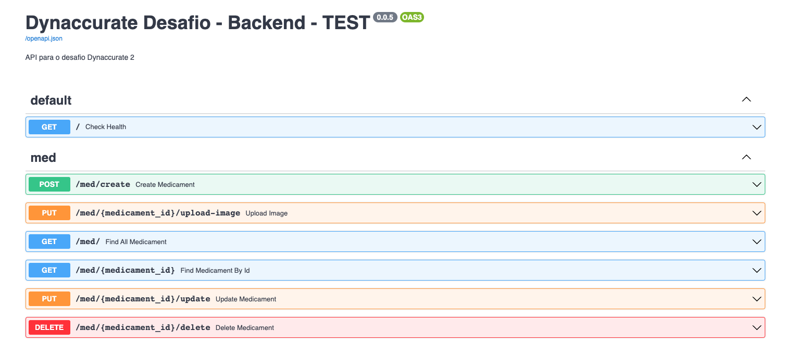

# Dynaccurate - Desafio - Backend

<p align="center">
  
  
  
</p>
<br>

<p align="center">
  <a href="https://github.com/ocoiel/desafio-dynaccurate-frontend">Frontend</a> •
  <a href="#tecnologias">Tecnologias</a> •
  <a href="#dynaccurate">O Desafio</a> •
  <a href="#instalação">Instalação</a> •
  <a href="#rotas">Rotas</a> •
  <a href="#todo">To Do</a> •
  <a href="#autor">Autor</a>
</p>

<br>

## Tecnologias

Projeto desenvolvido usando as seguintes tecnologias.

- Python 3.11
- FastAPI 0.95
- Poetry (Gerenciador de dependências e ambiente)
- Prisma + PostgreSQL (ORM)
- Docker ⚠️
- Linters (Flake8, Black, Pylint)

### Arquitetura

- Clean Architecture - Robert C. Martin (Uncle Bob) • (https://blog.cleancoder.com/uncle-bob/2012/08/13/the-clean-architecture.html)
- DDD (Domain-drive Design) - Eric Evans • (https://fullcycle.com.br/domain-driven-design/)

> ### Princípios

- Single Responsibility (S do Solid)
- Open Closed (O do Solid)
- Liskov Substitution (L do Solid)
- Interface Segregation (I do Solid)
- Dependency Inversion (D do Solid)
- Separation of Concerns (SOC)
- Don't Repeat Yourself (DRY)
- Keep It Simple (KIS)
- You Aren't Gonna Need It

> ### Design patterns

- Use Cases
- Repositories
- Data mappers
- Data Transfer Object (DTO)
- ViewModels (C#)
- InMemory Database ⚠️
- Dependency Diagrams

<br>
<br>


## Dynaccurate

### Desafio - Gestão de medicamentos

Este desafio consiste em desenvolver uma aplicação web para a gestão de
medicamentos. A aplicação deve permitir inserir, consultar, editar e buscar informações sobre
medicamentos. A aplicação deve ser desenvolvida utilizando o framework FastAPI para o backend em
Python, o banco de dados PostgreSQL, o Next.js para o frontend em React

## Instalação

Antes de começar, você vai precisar ter instalado em sua máquina as seguintes ferramentas:
[Git](https://git-scm.com), [Python](https://www.python.org/downloads/) e [Docker](https://docs.docker.com/compose/install/)

- Poetry: (Linux, Mac ou Windows com WSL)

```bash
$ curl -sSL https://install.python-poetry.org | python3 -
```

### 🎲 Rodando o projeto.

```bash
# Clone este repositório
$ git clone https://github.com/ocoiel/desafio-dynaccurate-backend.git

# Acesse a pasta do projeto no terminal/cmd
$ cd desafio-dynaccurate-backend

# Instale as dependências
$ poetry install

# Habilitar o shell para outros comandos
$ poetry shell

# Lembre-se de preencher as variáveis de ambiente
$ cp .env.example .env

# Subir os containers (Banco de dado postgre ✅) e (Aplicação em si ❌ [erro no Prisma - ToDo])
$ docker-compose -f .docker/docker-compose.yaml --env-file .env up -d

# Gerar cliente Prisma
$ prisma generate --schema src/infrastructure/database/prisma/schema.prisma

# Enviar o schema atualizado pro banco de dados
$ prisma db push --schema src/infrastructure/database/prisma/schema.prisma

# Rodar a API (localmente)
$ poetry run python3 -m src.infrastructure.http.server


# O servidor inciará na porta 3333 - acesse <http://localhost:3333/docs>
```

## Rotas



<br />

## Estrutura da rota GET /med (com paginação)

```json
{
  "items": [
    {
      "id": "string",
      "name": "string",
      "price": 0,
      "status": "string",
      "priority": "string",
      "description": "string",
      "image_url": "string",
      "expiration_date": "2023-05-18T17:58:25.154Z"
    }
  ],
  "total": 0,
  "page": 1,
  "size": 1,
  "pages": 0
}
```

## todo

- [x] Usar Clean Architecture
- [x] Substituir SQLAlchemy (ORM) + Alembic (Migrations) pelo Prisma
- [ ] Resolver erro do Docker com Prisma
- [ ] Adicionar testes unitários e e2e com pytest
- [ ] Adicionar upload ao AWS S3
- [ ] Adicionar o design pattern de factories
- [ ] Deploy (app + db) em alguma plataforma (Railway, Render, etc)

<br><br><br>

## Autor

<div align="center">

<h1>Gabriel Albuquerque</h1>
<strong>Desenvolvedor Frontend</strong>
<br/>
<br/>

<a href="https://linkedin.com/in/albuquerque-gabrielc" target="_blank">

</a>

<a href="https://github.com/ocoiel" target="_blank">

</a>

<a href="mailto:albuquerque.gabrielc@gmail.com?subject=Fala%20Gabriel" target="_blank">

</a>

<a href="https://api.whatsapp.com/send?phone=5521990363677" target="_blank">

</a>

<br/>
<br/>
</div>
